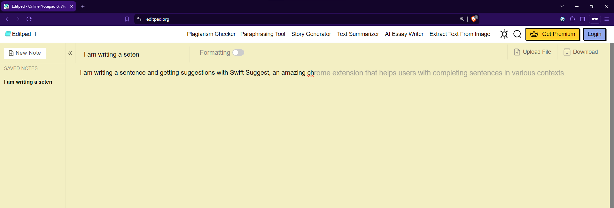

  

     

<h2 align="center">Swift Suggest</h2>

 

<strong>Swift Suggest</strong> is an <strong>open-source</strong> MIT-licensed <strong>browser extension</strong> that provides real-time, context-aware <strong> AI suggestions as you type</strong>, helping you write faster and more accurately. 

 
 

## Features

- **Real-time suggestions**: Swift Suggest provides suggestions as you type, helping you write faster and more accurately.
- **Context-aware suggestions**: Swift Suggest provides suggestions based on the context of your code, helping you write more accurately.
- **OpenAI**: Swift Suggest uses the OpenAI API to provide suggestions, ensuring high-quality suggestions.

 

 

## Installation

To install Swift Suggest, follow these steps:

1. Download the Swift Suggest from this repository.
2. Unzip the downloaded file.
3. Open Chrome and go to `chrome://extensions`.
4. Enable Developer mode by clicking the toggle switch in the top right corner.
5. Click on the `Load unpacked` button and select the unzipped folder.
6. Swift Suggest should now be installed and ready to use.

## Usage

To use Swift Suggest, follow these steps:

1. Open a new tab in Chrome.
2. Click on the Swift Suggest icon in the top right corner of the browser window.
3. Click on the `Settings` button.
4. Add your OpenAI API key in the `API Key` field.
5. Click on the `Save` button.
6. Start typing in any text field, and Swift Suggest will provide suggestions as you type.

## Roadmap

Currently, Swift Suggest is only a proof-of-concept. 
Here are some features that are planned for future releases:

- **Customizable AI Models**: Allow users to choose from different AI models to provide suggestions.
- **Work out of the box**: Remove the need for users to provide their own OpenAI API key for basic functionality but allow users to provide their own key for advanced features and customization.
- **Deployment**: Deploy Swift Suggest as a Chrome extension on the Chrome Web Store and other extension stores.
- **UI Improvements**: Improve the user interface to make it more user-friendly and intuitive.

## Contributing

Any contributions you make are **greatly appreciated**. To contribute to Swift Suggest, follow these steps:

1. Fork the project.
2. Create your feature branch (`git checkout -b feature/AmazingFeature`).
3. Commit your changes (`git commit -m 'Add some AmazingFeature'`).
4. Push to the branch (`git push origin feature/AmazingFeature`).
5. Open a pull request.

If you find a bug or have a feature request, please open an issue.

## License

Distributed under the MIT License. See `LICENSE` for more information.

